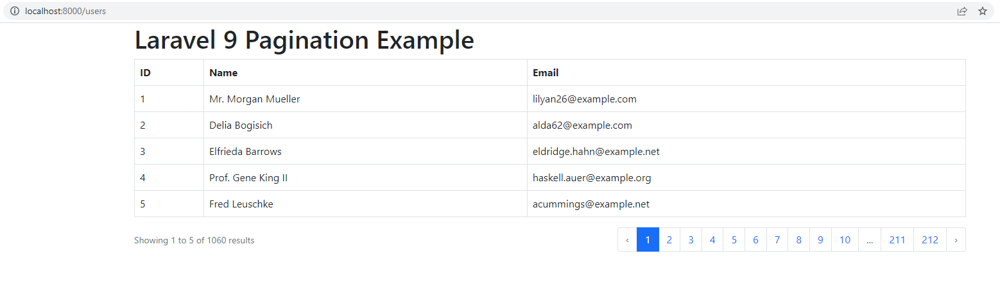

# laravel9_pagination
## 1: Install Laravel 9
```Dockerfile
composer create-project laravel/laravel laravel9_pagination
```
## 2: Database Configuration
- Vào .env
```Dockerfile
DB_CONNECTION=mysql
DB_HOST=127.0.0.1
DB_PORT=3306
DB_DATABASE=here your database name(blog)
DB_USERNAME=here database username(root)
DB_PASSWORD=here database password(root)
```
## 3: Create Dummy Users
```Dockerfile
php artisan migrate
```
```Dockerfile
php artisan tinker
User::factory()->count(100)->create()
```
## 4: Add Route
- routes/web.php
```Dockerfile
<?php
  
use Illuminate\Support\Facades\Route;
  
use App\Http\Controllers\UserController;
  
/*
|--------------------------------------------------------------------------
| Web Routes
|--------------------------------------------------------------------------
|
| Here is where you can register web routes for your application. These
| routes are loaded by the RouteServiceProvider within a group which
| contains the "web" middleware group. Now create something great!
|
*/
  
Route::get('users', [UserController::class, 'index']);
```
## 5: Create Controller
- app/Http/Controllers/UserController.php
```Dockerfile
<?php
  
namespace App\Http\Controllers;
  
use Illuminate\Http\Request;
use App\Models\User;
  
class UserController extends Controller
{
    /**
     * Display a listing of the resource.
     *
     * @return \Illuminate\Http\Response
     */
    public function index(Request $request)
    {
        $users = User::paginate(5);
  
        return view('users', compact('users'));
    }
}
```
## 6: Create Blade File
- resources/views/users.blade.php
```Dockerfile
<!DOCTYPE html>
<html>
<head>
    <title>Laravel 9 Pagination Example - ItSolutionStuff.com</title>
    <link href="https://cdnjs.cloudflare.com/ajax/libs/twitter-bootstrap/5.0.1/css/bootstrap.min.css" rel="stylesheet">
</head>
<body>
      
<div class="container">
    <h1>Laravel 9 Pagination Example - ItSolutionStuff.com</h1>
  
    <table class="table table-bordered data-table">
        <thead>
            <tr>
                <th>ID</th>
                <th>Name</th>
                <th>Email</th>
            </tr>
        </thead>
        <tbody>
            @forelse($users as $user)
                <tr>
                    <td>{{ $user->id }}</td>
                    <td>{{ $user->name }}</td>
                    <td>{{ $user->email }}</td>
                </tr>
            @empty
                <tr>
                    <td colspan="3">There are no users.</td>
                </tr>
            @endforelse
        </tbody>
    </table>
  
    <!-- 
        You can use Tailwind CSS Pagination as like here:
        {!! $users->withQueryString()->links() !!}        
    -->
  
    {!! $users->withQueryString()->links('pagination::bootstrap-5') !!}
</div>
     
</body>
     
</html>
```
## 6: Run Laravel App:
```Dockerfile
php artisan serve
```
- Vào http://localhost:8000/users



## 7:Pagination with appends parameter
```Dockerfile
{!! $data->appends(['sort' => 'votes'])->links() !!}
```
## 8:Pagination with appends request all parameters
```Dockerfile
{!! $data->appends(Request::all())->links() !!}
```


